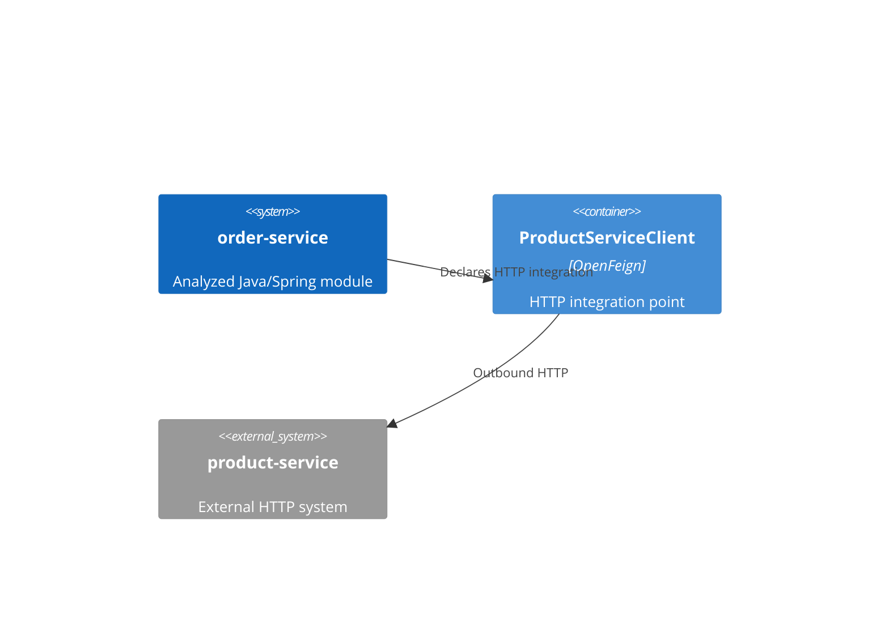

# Outbound HTTP dependencies: order-service

**Module:** order-service
**Module path:** /Users/edsnodgrass/Projects/build-a-software-factory/order-service

## Summary

Found 1 statically declared Feign outbound HTTP dependency.

## Finding 1: product-service

order-service makes an outbound HTTP connection to product-service through its ProductServiceClient Feign integration point.

- **External system:** product-service
- **Destination:** ${product-service.url} (destination unresolved)
- **Confidence:** Lower confidence. The client declaration is visible, but the destination contains an unresolved property placeholder. Its value was not guessed or resolved.
- **Client declaration evidence:** src/main/java/com/orderservice/client/ProductServiceClient.java:13

### HTTP operations (supporting detail)

- GET /products/{productId} (declared operation: getProduct). Evidence: src/main/java/com/orderservice/client/ProductServiceClient.java:16.

## Architectural connections

## Limitations

ArchR analyzed Java source declarations only; it did not compile, run, or modify the module. It did not resolve configuration or property placeholders.

ArchR did not inspect callers and therefore did not determine whether a separate domain-facing port or adapter is needed. A Feign integration point is not assumed to be a sufficient architectural adapter.

Only supported Spring OpenFeign declarations and mapping annotations are reported. Other outbound HTTP mechanisms, messaging, databases, inherited operations, and runtime behavior are outside this analysis.
